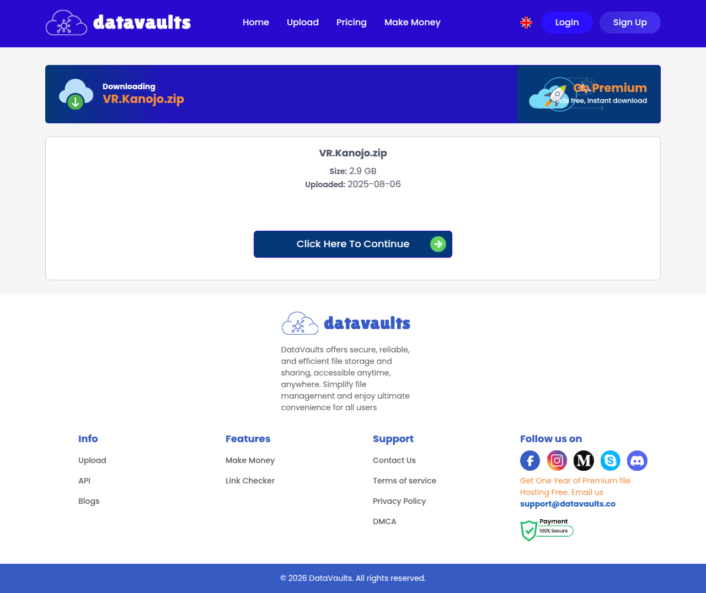

# Visited: https://datavaults.co/lklecxdx3gv5/VR.Kanojo.zip
**Time:** Mon May 18 13:22:51 UTC 2026

## Screenshot

## Raw HTML
[page.html](./page.html)

## Downloaded Media (38 files)
## Downloaded Media Files

- [favicon.ico](./media/favicon.ico) (15 KB)

## Other Links
- [https://datavaults.co/lklecxdx3gv5/#](https://datavaults.co/lklecxdx3gv5/#)
- [https://datavaults.co/lklecxdx3gv5/#admin_files](https://datavaults.co/lklecxdx3gv5/#admin_files)
- [https://datavaults.co/lklecxdx3gv5/#admin_servers](https://datavaults.co/lklecxdx3gv5/#admin_servers)
- [https://datavaults.co/lklecxdx3gv5/#admin_stats](https://datavaults.co/lklecxdx3gv5/#admin_stats)
- [https://datavaults.co/lklecxdx3gv5/#admin_users](https://datavaults.co/lklecxdx3gv5/#admin_users)
- [https://datavaults.co/](https://datavaults.co/)
- [https://datavaults.co/admin/settings/](https://datavaults.co/admin/settings/)
- [https://datavaults.co/cdn-cgi/l/email-protection#eb989e9b9b84999fab8f8a9f8a9d8a9e879f98c58884](https://datavaults.co/cdn-cgi/l/email-protection#eb989e9b9b84999fab8f8a9f8a9d8a9e879f98c58884)
- [https://datavaults.co/cdn-cgi/scripts/5c5dd728/cloudflare-static/email-decode.min.js](https://datavaults.co/cdn-cgi/scripts/5c5dd728/cloudflare-static/email-decode.min.js)
- [https://code.jquery.com/jquery-3.2.1.min.js](https://code.jquery.com/jquery-3.2.1.min.js)
- [https://datavaults.co](https://datavaults.co)
- [https://datavaults.co/admin/ads/](https://datavaults.co/admin/ads/)
- [https://datavaults.co/admin/anti/hack/](https://datavaults.co/admin/anti/hack/)
- [https://datavaults.co/admin/bans/list/](https://datavaults.co/admin/bans/list/)
- [https://datavaults.co/admin/comments/](https://datavaults.co/admin/comments/)
- [https://datavaults.co/admin/downloads/](https://datavaults.co/admin/downloads/)
- [https://datavaults.co/admin/enc/list/](https://datavaults.co/admin/enc/list/)
- [https://datavaults.co/admin/external/](https://datavaults.co/admin/external/)
- [https://datavaults.co/admin/files/](https://datavaults.co/admin/files/)
- [https://datavaults.co/admin/install/](https://datavaults.co/admin/install/)
- [https://datavaults.co/admin/mass/email/](https://datavaults.co/admin/mass/email/)
- [https://datavaults.co/admin/news/](https://datavaults.co/admin/news/)
- [https://datavaults.co/admin/payments/](https://datavaults.co/admin/payments/)
- [https://datavaults.co/admin/reports/](https://datavaults.co/admin/reports/)
- [https://datavaults.co/admin/reseller/codes/](https://datavaults.co/admin/reseller/codes/)
- [https://datavaults.co/admin/servers/](https://datavaults.co/admin/servers/)
- [https://datavaults.co/admin/stats?section=charts](https://datavaults.co/admin/stats?section=charts)
- [https://datavaults.co/admin/stats?section=details](https://datavaults.co/admin/stats?section=details)
- [https://datavaults.co/admin/stats?section=payments](https://datavaults.co/admin/stats?section=payments)
- [https://datavaults.co/admin/torrents/](https://datavaults.co/admin/torrents/)
- [https://datavaults.co/admin/transfer/list/](https://datavaults.co/admin/transfer/list/)
- [https://datavaults.co/admin/user_roles/](https://datavaults.co/admin/user_roles/)
- [https://datavaults.co/admin/users/](https://datavaults.co/admin/users/)
- [https://datavaults.co/admin/users/add/](https://datavaults.co/admin/users/add/)
- [https://datavaults.co/admin/websites/](https://datavaults.co/admin/websites/)
- [https://datavaults.co/admin/white/list/](https://datavaults.co/admin/white/list/)
- [https://datavaults.co/change_lang?lang=arabic](https://datavaults.co/change_lang?lang=arabic)
- [https://datavaults.co/change_lang?lang=dutch](https://datavaults.co/change_lang?lang=dutch)
- [https://datavaults.co/change_lang?lang=french](https://datavaults.co/change_lang?lang=french)
- [https://datavaults.co/change_lang?lang=german](https://datavaults.co/change_lang?lang=german)
- [https://datavaults.co/change_lang?lang=hebrew](https://datavaults.co/change_lang?lang=hebrew)
- [https://datavaults.co/change_lang?lang=hungary](https://datavaults.co/change_lang?lang=hungary)
- [https://datavaults.co/change_lang?lang=indonesia](https://datavaults.co/change_lang?lang=indonesia)
- [https://datavaults.co/change_lang?lang=japan](https://datavaults.co/change_lang?lang=japan)
- [https://datavaults.co/change_lang?lang=polish](https://datavaults.co/change_lang?lang=polish)
- [https://datavaults.co/change_lang?lang=russian](https://datavaults.co/change_lang?lang=russian)
- [https://datavaults.co/change_lang?lang=spanish](https://datavaults.co/change_lang?lang=spanish)
- [https://datavaults.co/change_lang?lang=thai](https://datavaults.co/change_lang?lang=thai)
- [https://datavaults.co/change_lang?lang=turkish](https://datavaults.co/change_lang?lang=turkish)
- [https://datavaults.co/check_files/](https://datavaults.co/check_files/)

## Stats
- Links: 124
- Media: 38
